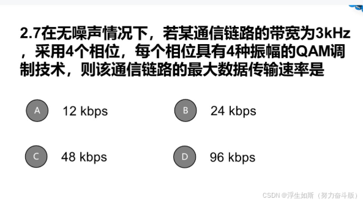
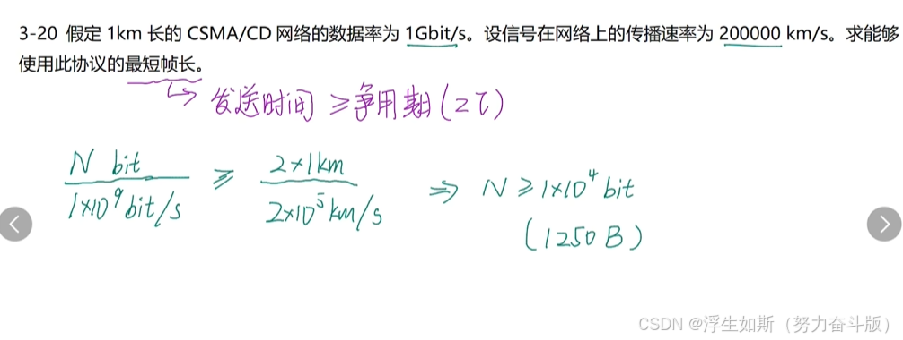
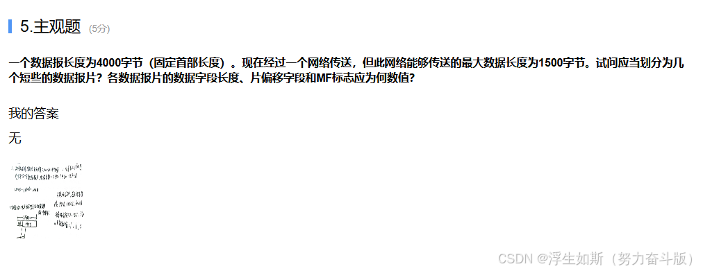
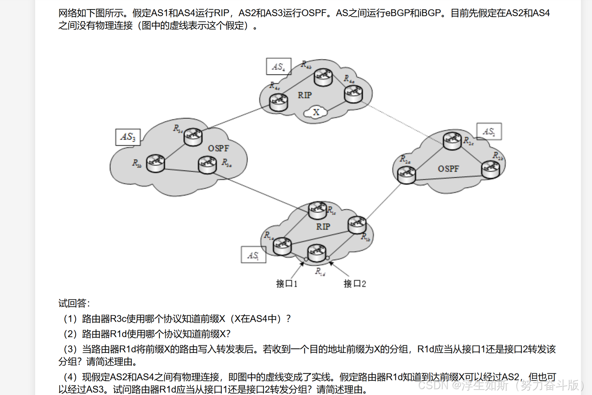
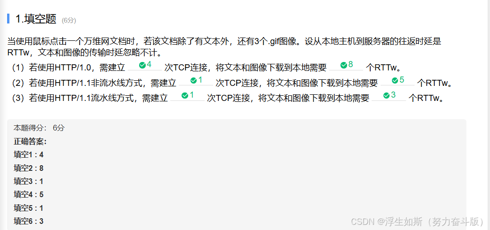

附加期末复习资料链接：通过网盘分享的文件：22级想躺平的人的期末资料.zip
链接: https://pan.baidu.com/s/1zdrqPO0IhV7Ed90zFOjx0A 提取码: c7cu

# Henu 期末考试回忆版

## 一、计算机网络

### 1. 选择，填空是基础知识点，雨课堂基础

**知识掌握即可**

### 2. 简答题

**（1）奈氏准则**

考的就是这道题知识，一模一样

**（2）求最短帧长，然后算传播多少的数据**

**（3）数据包分片**

**（4）RIP, OSPF 和 BGP**

考的比下面简单的多，比如域间选 BGP，域内选 RIP 和 OSPF

**（5）HTTP1.0, HTTP1.1 流水线和非流水线 RTT 次数和建立 TCP 次数**

### 3. 网络拓扑题

给了一个简单的网络拓扑图，一个 DHCP 服务器，一个路由器，一个交换机，若干主机。

（1）华为路由器配置 ip 地址和子网掩码，做实验应该清楚

（2）考的应该是主机 ip 地址如何划分，有个地址聚合

（3）考的是主机要与网络建立连接经过交换机和路由器，第一次目的物理地址是，第二次目的地址是

（4）考的是 10Mbit/s 以太网，连接 10 个主机，每个主机速率还是 10Mbit/s
